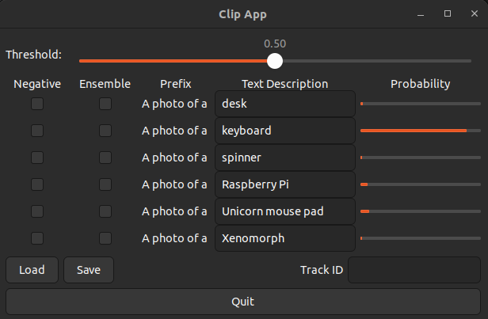

# CLIP Zero Shot Inference Application

This is an example application to run a CLIP inference on a video in real-time. The image embeddings are accelerated by the Hailo-8/8L AI processor, while the text embeddings run on the host. Text embeddings are sparse and should be calculated only once per text. If they do not need to be updated in real-time, they can be saved to a JSON file and loaded on the next run. By default, the app starts without enabling online text embeddings, which speeds up load time and saves memory.

## Prerequisites

This example has been tested with Hailo's TAPPAS v3.28.0 and TAPPAS-CORE v3.28.2 (RPi version). Please ensure that you have one of these versions installed on your system.

#### Required Packages for CLIP

```bash
sudo apt-get -y install libblas-dev nlohmann-json3-dev
```

To run the example, ensure your environment is set up correctly. We use Hailo `pkgconfig` files to manage Hailo dependencies. We support two packages, but you only need to install one of them:
- **`hailo-tappas-core`**: TAPPAS core installation using a `.deb` file or `apt install`.
- **`hailo_tappas`**: For full TAPPAS installation. See instructions in our [TAPPAS repository](https://github.com/hailo-ai/tappas).

You can set everything up by sourcing the `setup_env.sh` script. This script sets the required environment variables and activates the Hailo virtual environment (if it doesn't exist, it will create it). For TAPPAS installation, the script reuses the TAPPAS default virtual environment `${TAPPAS_WORKSPACE}/hailo_tappas_venv`. For TAPPAS-CORE installation, it creates a new local virtual environment named `hailo_clip_venv`. The script also checks which Hailo device you have and sets the architecture accordingly. Make sure you have the Hailo device connected to your machine.

```bash
source setup_env.sh
```

If you get a response that looks like this, you're good to go:

```bash
Setting up the environment...
Setting up the environment for hailo-tappas-core...
TAPPAS_VERSION is 3.28.2. Proceeding...
You are not in the venv_hailo_rpi5_examples virtual environment.
Virtual environment exists. Activating...
TAPPAS_POST_PROC_DIR set to /usr/lib/aarch64-linux-gnu/hailo/tappas//post-process/
Device Architecture is set to: HAILO8L
```

## Installation

Make sure you run `source setup_env.sh` before running the installation. To install the application, run the following in the application root directory:

```bash
python3 -m pip install -v -e .
```

This will install the app as a Python package in "editable" mode. It will also [compile the CPP code](#cpp-code-compilation) and download the required HEF files and videos.

## Usage

Make sure you run `source setup_env.sh` before running the application.

Run the example:

```bash
clip_app --input demo
```
On the first run, CLIP will download the required models. This will happen only once.

The code can also be run directly using `python` like this:

```bash
python3 -m clip_app.clip_app
```

### Arguments

```bash
clip_app -h
usage: clip_app [-h] [--input INPUT] [--detector {person,face,none}] [--json-path JSON_PATH] [--disable-sync] [--dump-dot]
                [--detection-threshold DETECTION_THRESHOLD] [--show-fps] [--enable-callback] [--callback-path CALLBACK_PATH]
                [--disable-runtime-prompts]

Hailo online CLIP app

options:
  -h, --help            show this help message and exit
  --input INPUT, -i INPUT
                        URI of the input stream. Default is /dev/video0. Use '--input demo' to use the demo video.
  --detector {person,face,none}, -d {person,face,none}
                        Which detection pipeline to use.
  --json-path JSON_PATH
                        Path to JSON file to load and save embeddings. If not set, embeddings.json will be used.
  --disable-sync        Disables display sink sync, will run as fast as possible. Relevant when using file source.
  --dump-dot            Dump the pipeline graph to a dot file.
  --detection-threshold DETECTION_THRESHOLD
                        Detection threshold.
  --show-fps, -f        Print FPS on sink.
  --enable-callback     Enables the use of the callback function.
  --callback-path CALLBACK_PATH
                        Path to the custom user callback file.
  --disable-runtime-prompts
                        When set, app will not support runtime prompts. Default is False.
```

### Modes

- **Default mode (`--detector none`)**: Runs only the CLIP inference on the entire frame. This mode is what CLIP is trained for and will give the best results. CLIP will be run on every frame.
- **Person mode (`--detector person`)**: Runs the CLIP inference only on detected persons. In this mode, we first run a person detector and then run CLIP on the detected persons. CLIP acts as a person classifier in this mode and will run only on detected persons. To reduce the number of CLIP inferences, we run CLIP only every second per tracked person. This can be changed in the code.
- **Face mode (`--detector face`)**: Runs the CLIP inference only on detected faces. This is similar to person mode but for faces. Results in this mode are not as good as person mode (cropped faces are probably not well represented in the dataset). You can experiment with it to see if it fits your application.

### Using Web Camera Input
Before running the application, ensure a camera is connected to your device. Use the `--input` flag to specify the camera device, defaulting to `/dev/video0`.
Verify that the camera device you use is mapped to a supported camera, particularly relevant for the Raspberry Pi. To confirm camera support, run the following command:

```bash
ffplay /dev/video0
```
If you see the camera feed, the device is supported. If not, try `/dev/video2`, `/dev/video4`, etc. (devices are usually mapped to an even number).
Once you identify your camera device, you can run the application as follows:
```bash
clip_app --input /dev/video0
```

## UI Controls



- **Threshold Slider**: Adjusts the threshold for CLIP classification. Classifications with probabilities lower than this threshold will be ignored.
- **Negative Checkbox**: Marks the classification as a negative prompt. It will be included in the Softmax calculation but will not be shown in the output.
- **Ensemble Checkbox**: Enables ensemble mode, where the prompt text embedding is calculated with variations to improve results. See `ensemble_template` in `text_image_matcher.py` for more details.
- **Text Description**: The text prompt for CLIP classification.
- **Probability Bars**: Displays the probability of various classifications in real-time.
- **Load Button**: Loads the text embeddings from a JSON file specified by the `--json-path` flag.
- **Save Button**: Saves the text embeddings to a JSON file specified by the `--json-path` flag.
- **Track ID**: Displays the classification probabilities for a specific person in person mode. The track ID appears in the bottom left corner of the bounding box.
- **Quit Button**: Exits the application.

## Tips for Good Prompt Usage

- Keep in mind that the network was trained on image + caption pairs. Your text description should be somewhat similar. For example, a text description of "A photo of a cat" will give a better score than "cat".
- The app has a pre-defined "prefix" of "A photo of a" which you can change in the `TextImageMatcher` class.
- The pipeline output will select one of the classes as "the best one". There is no `background` class. You should define a "negative" prompt (or prompts) to be used as `background`. When set as `negative`, the class will be used in the "best match" algorithm but will not be shown in the output.
- You can also use `threshold` to fine-tune detection sensitivity. However, using `negative` prompts is better for detecting specific classes.
- Negative prompts should be used to "peel off" similar classifications to your target. For example, "a man with a red shirt" will have a high score for just a man or a shirt of a different color. Add negative prompts like "a man with a blue shirt" to ensure you do not get lots of false classifications.
- Play around with prompts to see what works best for your application.

## Integrating Your Code

You can integrate your code in the `user_callback.py` file. This file includes a user-defined `app_callback` function that is called after the CLIP inference and before the display. You can use it to add your logic to the app. The `app_callback_class` will be passed to the callback function and can be used to access the app's data. 
To enable executing the callback function, use the `--enable-callback` flag. 
By default, the application will use `clip_app/user_callback.py` as the callback file. You can change it using the `--callback-path` flag. When setting a custom callback file, the callback will be enabled automatically.

### Online Text Embeddings

- The application will run the text embeddings on the host, allowing you to change the text on the fly. This mode might not work on weak machines as it requires a host with enough memory to run the text embeddings model (on CPU). See [Offline Text Embeddings](#offline-text-embeddings) for more details.
- You can set which JSON file to use for saving and loading embeddings using the `--json-path` flag. If not set, `embeddings.json` will be used.
- If you wish to load/save your JSON, use the `--json-path` flag explicitly.

### Offline Text Embeddings

- To run without online text embeddings, you can set the `--disable-runtime-prompts` flag. This will speed up the load time and save memory. Additionally, you can use the app without the `torch` and `torchvision` dependencies. This might be suitable for final application deployment.
- You can save the embeddings to a JSON file and load them on the next run. This will not require running the text embeddings on the host.
- If you need to prepare text embeddings on a weak machine, you can use the `text_image_matcher` tool. This tool will run the text embeddings on the host and save them to a JSON file without running the full pipeline. This tool assumes the first text is a 'positive' prompt and the rest are negative.

```bash
text_image_matcher -h
usage: text_image_matcher [-h] [--output OUTPUT] [--interactive] [--image-path IMAGE_PATH] [--texts-list TEXTS_LIST [TEXTS_LIST ...]]

options:
  -h, --help            show this help message and exit
  --output OUTPUT       Output file name (default: text_embeddings.json).
  --interactive         Input text from an interactive shell.
  --image-path IMAGE_PATH
                        Optional, path to an image file to match. Note: image embeddings are not running on Hailo here.
  --texts-list TEXTS_LIST [TEXTS_LIST ...]
                        A list of texts to add to the matcher; the first one will be the searched text, and the others will be considered negative prompts. Example: --texts-list "cat" "dog" "yellow car".
```

## CPP Code Compilation

Some CPP code is used in this app for post-processing and cropping. This code should be compiled before running the example. It uses Hailo `pkg-config` to find the required libraries.

The compilation script is `compile_postprocess.sh`. You can run it manually, but it will be executed automatically when installing the package. The post-process `.so` files will be installed under the resources directory.
