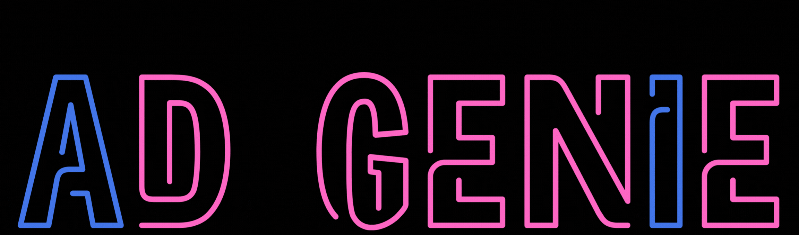
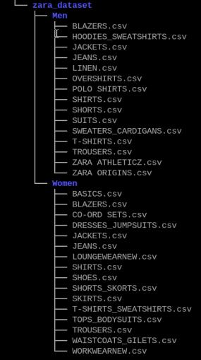

# AD GENIE - Personalized Advertisement - Hailo Hackathon 2025


# Watch our Youtube video
### [](<https://youtu.be/_PN4cdiFKmw>)

## Overview
This project personalizes ads using the CLIP model. 
It runs on Raspberry Pi 5, AI+ HAT (with the Hailo 8 device).
The project is a runtime project which receives an input from a USB camera (of a person wearing a certain outfit) and outputs images of the outfit that fits most the "style" of the person (from a certain database).

This system resembles a content personalization system in public spaces, and is capable of interacting with nearby individuals and tailoring commercial content to their preferences.

The system can be utilized in various public settings, such as shopping malls, street billboards, and bus station displays. In retail settings, it serves as a tool to elevate the looks of shop window displays, attracting and engaging customers to enter the store.

 ## Setup Instructions
- Follow README setup instructions of [CLIP application example](../../README.md) 

### Register and Download
- Register and download zara dataset from [Zara Dataset](https://www.kaggle.com/datasets/abhinavtyagi2708/zara-dataset-men-and-women-clothing)

### Organize Dataset Structure
- The downloaded dataset is a zip files, unzip it to a folder.
- The dataset contains a Men directory inside another Men directory, and the same applies for Women. Remove the redundant nested directories.
- Delete all categories that are not clothing, such as:
    - Shoes
    - Bags
    - Jewelry
    - Special Prices
    - Perfumes
    - Accessories
    - Beauty


### Run Data Preparation Script

- Execute the data_preparation.py script to create zara.json and an images directory containing all images under the resources directory. Note that this process might take 30-40 minutes, and some downloads may fail.
    ```bash
    python data_preparation.py --data <path to zara dataset>
    ```
### Run Labels Preparation Script
- Execute the labels_preparation.py script to generate labels.json.
    ```bash
    python lables_preparation.py --json-path <path to zara.json>
    ``` 
### Creating Data Embeddings
- Generate data embeddings using the following command (this step takes approximately 15 minutes):
    ```bash
    text_image_matcher --texts-json resources/lables.json --output resources/data_embdedding.json
    ```
### Adjusting the Threshold
- Open resources/data_embedding.json and locate the threshold at the beginning of the file. Change its value from 0.8 to 0.01.

## Running Example
```bash
python ad_genie.py -d person -i /dev/video0 --json-path resources/data_embdedding.json --enable-callback
```
- Check Your USB camera port using get-usb-camera
